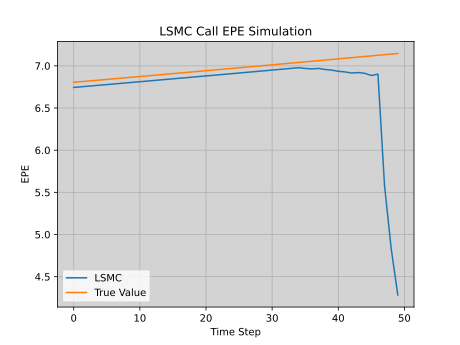
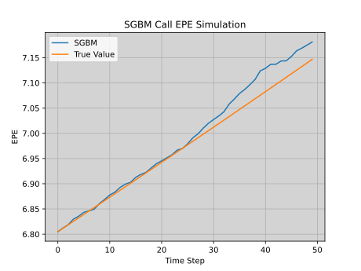
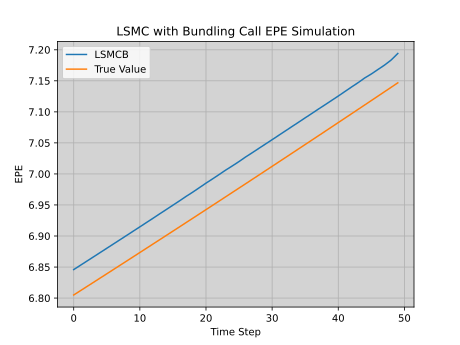
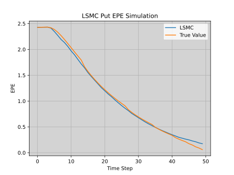
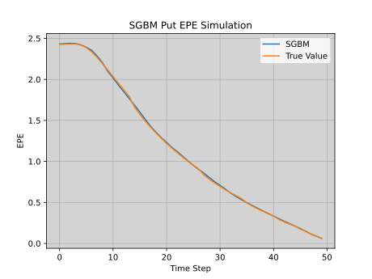
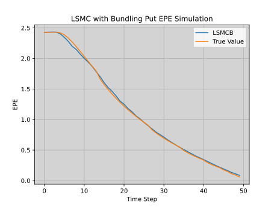

# SGBM-vs-LSMC-for-CVA
This repo comapres two methods for calculating the continuation values of options for the purpose of calculating the EPE for CVA. The two methods are LSMC from Longstaff and Schwartz [^lsmc] and the more recent SGBM from Jain and Oosterlee [^sgbm].

This project uses Python 3.14.2.

# CVA and EPE calculations
When selling a financial product like an IRS or exotic option to a third party there's always the risk that the party goes bust while the product is in the money or positive for you. On the other hand, there's the chance the party goes bust when the product is in the negative for you, but you are not saved here, you are actually due to pay the mark to market value to help in the liquidation efforts. This asymmetric payoff is the problem that CVA attempts to solve. We will state some of the main results from the CVA derivation but for more details I recommend reading [^brigo]. The key equation with CVA work which can be derived fairly easily is,

$$
CVA = E_t(LGD_c 1_{\{t<\tau_c \leq T\}}D(t,\tau_c)[NPV_b(\tau_c)]^+).
$$

Here, b is the party who is doing the CVA and c is the party that has bought the product. $\tau_c$ is the time when c goes bust, $LGD_c$ is $1-REC_c$ where $REC_c$ is the recovery rate of assets when c goes bust. Also, $t$ is the time that the CVA is being valued and $T$ is the time the option exercises, $D$ is the discount rate and $NPV_b(\tau_c)$ is the net present value at the time when c goes bust. So if we are to break apart this equation it essentially states that the CVA amount we need to offset the product by is equivalent to the expected profit we could lose if c goes bust before the option expires. 

Assuming the independence of exposure and default, and a deterministic recovery rate we can actually break this further and discretise the integral to get,

$$
CVA = \sum_{i=1}^{N} D(t,t_i)EPE(t_i)(Q(\tau_c>t_i)-Q(\tau_c > t_{i+1})).
$$

Here we go through $N$ steps between $t$ and $T$, and we attribute a risk neutral CDF of default and $EPE(t_i)$ is the expected positive exposure at $t_i$. $EPE$ is the main focus of this project, as extracting it is one of the key steps in calculating the CVA. One of the simplest methods is using the LSMC which is a regression based method that produces continuation values as a byproduct which could be used here. Another approach is the more recent SGBM. We compare these methods and try and analyse where the methods differ and why they result in different levels of accuracy in estimation. 

# LSMC

Least squares monte carlo is a method suggested by Longstaff and Schwartz [^lsmc]. The method attempts to estimate the continuation value at each time step by estimating the conditional expectation of the payoff. This value is then compared to exercising the option now, and then we work backwards with this new information. We use an adjusted version of LSMC where the least squares estimation will occur over all paths not just the ITM paths, which is consistent with our goal of calculating continuation values. So the method is:

1. Simulate M paths over N time steps (we use GBM)
2. Find the terminal payoff of each path, then using $S_{t_{N-1}}$ and basis functions (like polynomial powers) form a basis expansion regressed on the terminal payoff, $f(S_{t_{N-1}}) = \sum_{i=1}^{K} \beta_i b(S_{t_{N-1}})$ and $f(S_{t_{N-1}}) \approx D_{t_N - t_{N-1}} \max(h(S_{t_N}),0)$  where $D$ is the discounting factor.
3. Compare $\max(h(S_{t_N-1}),0)$ (exercise now) and $f(S_{t_{N-1}})$ (exercise later)
4. Continue this process over all time steps, importantly the regressand changes for a path if the option is exercised early.

# SGBM
Based on a paper by Jain and Oosterlee [^SGBM]. SGBM uses the following steps:
1. Generate M paths over N time steps using some simulation method (we use GBM)
2. Begin by finding the terminal value at the final time step $V_{t_N} = \max(h(S_{t_N}),0)$ where h is the payoff
3. Bundle the different paths together (this means partitioning the set of values through an algorithm like K-means, in this project we use the method suggested by the paper which is recursive bifurcation with state space reduction)
4. Then build a basis expansion where the target is $V_{t_N}$ and the regressors are the basis expansions of $S_{t_N}$ for each bundled set

$$
V_{t_N} = \sum_{i = 1}^{K}\beta_i b_i(S_{t_N})
$$

5. Using an analytic conditional expectation of the basis functions we can find the conditional expectation of $t_{N-1}$, specifically solve $E(b(S_{t_N})|S_{t_{N-1}})$ analytically for all $i = 1,...,K$ and for the simulation method used (this can be done easily for GBM).
6. Finally calculate the continuation value by inserting step 5 into the basis expansions from 4 and discount. Then compare this result to the value of exercising the option now.
7. Do steps 3-6 again where the terminal value changes if the option is exercised early at any time step

We notice the similarities between SGBM and LSMC, and notice that the key areas that the two methods diverge in are in the bundling step and in the basis expansion to the current time step (not the previous as LSMC) and then also using the analytic solution to the conditional expectation. 

Bundling as described in the paper has its own procedure. It uses the 'intrinsic value' function of the option to partition based on averages. The steps are as follows for time step $i$:
1. Begin by calculating $h(S_{t_i})$ for each path, and the average of all these intrinsic values.
2. Split the set into two sets (A_{1,0}, A_{1,1}) where paths go into each set based on whether their intrinsic value is above or below the average
3. Continue this procedure for p steps, each time we select a set from the previous iteration, find the mean intrinsic and then split the set on this mean. At the end we should have $2^p$ distinct sets of paths.

# LSMC and bundling (LSMCB)
This is the final method we compare, which uses LSMC as the backbone but also incorporates SGBM's bundling. This method has the following algorithm:
1. Simulate M paths over N time steps (we use GBM)
2. Split the previous time step ($t_{N-1}$) of stocks into multiple bundles (we use recursive bifurcation with state space reduction which was described previously)
3. For each bundle, Find the terminal payoff of each path, then using $S_{t_{N-1}}$ and basis functions (like polynomial powers) form a basis expansion regressed on the terminal payoff, $f(S_{t_{N-1}}) = \sum_{i=1}^{K} \beta_i b(S_{t_{N-1}})$ and $f(S_{t_{N-1}}) \approx D_{t_N - t_{N-1}} \max(h(S_{t_N}),0)$  where $D$ is the discounting factor.
4. Compare $\max(h(S_{t_N-1}),0)$ (exercise now) and $f(S_{t_{N-1}})$ (exercise later)
5. Continue this process over all time steps, importantly the regressand changes for a path if the option is exercised early.

# Method of Comparison

We are now going to build two tests to compare the methods on their calculated EPE. Each method will produce the continuation values of the options at different values and then using the intrinsic value we can get the potential exposure (PE) for each path. The PE for each path will be the continuation value at each time unless the option exercises, if the option exercises at that timestep the value becomes the intrinsic value and all future times have a PE of 0 since the option no longer can be exercised and no money can be lost if the counterparty defaults. The EPE is then just the average across paths of the PE.

To begin with we will vary the parameters for each method (number of basis functions and the number of bundles) and see which method results in the best fit of the true EPE using 25 simulations and 49 possible parameter pairs. After this, we select the best pair for each method and produce graphs for a single simulation along with the confusion matrix that shows exercise decisions and how they would compare to optimal exercise decisions. Finally we will run the simulations on the chosen parameters 100 times to compare the methods on RMSE, Bias, CVA error and time. The CVA calculation is made using a flat default chance of 2% for the year and the flat interest rate used throughout the project of 5%, and CVA error is the percentage difference between the true CVA and the estimated CVA.

# Case 1: American Call test

To begin with we will test these methods on GBM paths for an American Call option. 

Since it is never optimal to exercise an American Call early with non negative interest rates and no dividends, the methods should ideally never exercise early. The benchmark of the EPE should thus just be the European Call option price (which can be calculated using Black Scholes) growing with the interest rate over the time period. 

When uncovering the optimal parameters from the method we notice the stability of SGBM compared to LSMCB. LSMCB starts getting worse when the number of basis and the number of bundles increase, and while there is some stability around its optimal, it is not as stable as SGBM. This is very important when choosing parameters for methods with no closed form solution, since in those scenarios you have no reference to build this search grid over; SGBM has a clear advantage in these situations.

The graphs below measure the fits of the different methods along with the confusion matrix. We notice that LSMC is by far the worst method, and the reason seems to be that it exercises the call the most frequently. As a result, the EPE tends towards zero as it approaches the expiry. Figure 2 shows the SGBM graph which we notice agrees closely with the true value early but starts inflating the price later on. In fact, when we compare the exercise decisions for the two methods we notice that SGBM actually never exercises early and thus performs exactly as it theoretically should. This is due to the way SGBM constructs continuation values. From the first step, SGBM produces a basis expansion of the terminal payoff. Each step after uses the continuation value or the intrinsic, and crucially the continuation is in the span of the basis, hence it projects exactly. We also note that the continuation must be larger than the intrinsic: 

$$
\text{Continuation}_i = e^{-r\Delta t} E \[ V_{i+1}|S_i\] \geq e^{-r\Delta t} E \[ S_{i+1} - K |S_i\] = S_i - Ke^{-r\Delta t} > \text{intrinsic}_i.
$$

Putting these results together, SGBM should consistently calculate the continuation value as larger than the intrinsic value, as long as the initial step agrees with this as well. For a correctly chosen number of basis functions and bundles this happens and this explains why SGBM does not exercise early. 

On the other hand, LSMCB still exercises early at some time points, this is because the target of the basis expansion differs and is not part of the span. As a result, LSMCB's projection can be inaccurate at any time step, and this explains why the continuation value can occasionally dip below the intrinsic value.

Overall, this explains why SGBM performs better than the other methods on this test. Yet we notice that even the bundling step by itself when applied to LSMC improves the output considerably. When looking at the exercise decision, LSMCB makes the correct decision 99.5% of the time while LSMC makes the correct decision only 68.3% of times. 

  <b>Figure 1</b>

  

  <em>Figure 1: LSMC EPE graph for an American Call.</em>

  <b>Figure 2</b>

  

  <em>Figure 2: SGBM EPE graph for an American Call.</em>

  <b>Figure 3</b>

  

  <em>Figure 3: LSMCB EPE graph for an American Call.</em>

Table 1 below shows the different methods over 100 simulations and we notice that SGBM has the lowest RMSE and CVA error. LSMCB is not far behind, with a slightly higher RMSE and CVA error but equivalent bias and actually faster time to compute. The time to compute these results varies by the number of parameters used, and thus SGBM could be faster if a different set of parameters were chosen (this also would not have changed the results significantly due to the aforementioned stability of SGBM's parameter decisions). We do notice that LSMC is worse than both methods in almost all categories, with a CVA error that is 13 times larger than LSMCB. 

We can now use the following hypothesis test:

H0: The average RMSE/CVA error of method A ($\mu_A$) is less than or equal to the average RMSE/CVA error of method B ($\mu_B$), ($\mu_A - \mu_B \leq 0$).

H1: The average RMSE/CVA error of method A is larger than the average RMSE/CVA error of method B ($\mu_A - \mu_B > 0$).

We will use a t-test along with the sampled difference to find the confidence intervals. LSMC has a larger CVA error than LSMCB by about 3.40 with a confidence interval of [3.30,3.50], suggesting that there is a fairly big gap when bundling is used. On the other hand, the gap between LSMCB and SGBM is much more modest, with a mean of 0.11 with a confidence interval of [0.08,0.14]. 

  <b>Table 1: EPE statistics over 100 simulations</b>

  
| Model | RMSE | Bias | Time (s) | CVA Error (%) |
|---|---:|---:|---:|---:|
| LSMC | 0.600 | -0.256 | 0.812 | 3.669 |
| SGBM | 0.015 | 0.000 | 2.506 | 0.169 |
| LSMCB | 0.019 | 0.000 | 0.502 | 0.276 |

# Case 2: American Put Option

The American Put option does not have the same solution as the Call, since early exercise is actually optimal in certain conditions. As a result, all methods should exercise early for some portion of their paths and their decision of when to exercise will measure their loss. For this method we use the Cox-Ross-Rubinstein method to build a tree of stock prices over time, and use the probabilities to then uncover the expected option value at each point. We also ensure that the CRR method only gets 50 exercise dates, so that the comparison is fair with the methods which also only get 50 time steps to exercise the Put.

After picking the optimal parameters we produce the graphs which can be seen below. All methods seem to agree more closely to the EPE than the Call case, and SGBM again seems to fit the EPE the best. SGBM also makes the right decision on when to exercise most frequently at 95.7%, while LSMC and LSMCB are at 91.1% and 91.8% respectively. 

  <b>Figure 4</b>

  

  <em>Figure 4: LSMC EPE graph for an American Put.</em>

  <b>Figure 5</b>

  

  <em>Figure 5: SGBM EPE graph for an American Put.</em>

  <b>Figure 6</b>

  

  <em>Figure 6: LSMCB EPE graph for an American Put.</em>

The table below shows the results after 100 simulations. SGBM again is the better method, and this time it achieves a better result in all categories including time. SGBM has a roughly 5 fold decrease in CVA error from the other methods and half the RMSE of LSMCB and less than a third of LSMC. While SGBM is the best it is important to note that all methods differ by below a percentage point, and the gains here are much smaller, even though SGBM is the clear victor.

Using the same hypothesis test as before, we observe that LSMCB has a higher CVA error than SGBM by about 0.81% with a 95% confidence interval of [0.66, 0.97]. The difference in CVA error between LSMCB and LSMC was not significant, while the difference between their RMSE error was. LSMCB has a RMSE of 0.019 less than LSMC on average with a 95% confidence interval of [0.017, 0.020].

For the Put case, it seems that bundling is not the main contributor to SGBM's better performance. Instead, the analytic continuation seems to be making a bigger difference, resulting in the roughly 4% increase in paths that are exercised at the perfect time compared to LSMC and LSMCB. While this is still a modest difference, it also results in a lower CVA error by roughly 0.8% which suggests that even in cases where exercising early is required, SGBM is performing better than the other methods.

  <b>Table 2: EPE statistics over 100 simulations</b>

  
| Model | RMSE | Bias | Time (s) | CVA Error (%) |
|---|---:|---:|---:|---:|
| LSMC | 0.045 | -0.005 | 0.800 | 0.918 |
| SGBM | 0.013 | 0.002 | 0.691 | 0.200 |
| LSMCB | 0.026 | 0.007 | 0.761 | 1.01 |

# Conclusion

We have looked at the different methods and how they compare when using an American Call and Put options. SGBM
consistently performs better than LSMC and LSMCB, and as a result is the recommended choice when calculating the EPE for CVA purposes. These gains also seem to depend on bundling and the analytic conditional expectation for the Call and Put case respectively, where bundling in the Put case does not improve the results of LSMC (actually worsens it) and including the analytic conditioning in the Call case only produces a slightly better result. Furthermore, both these inclusions actually makes the parameter choice for SGBM far more stable, and thus SGBM is also a better choice for options that do not have closed form solutions, in this regard. Despite this, unlike LSMC and LSMCB, SGBM requires the conditional expectation of the stock value given the previous time step to be analytically tractable, which is a constraint for certain stock dynamics. 

# Extensions

Through rebuilding these methods in Python I was noticing that each of these methods have two large areas of error. First, they need to get the continuation value correct and next, they need to get the exercise time correct (which is calculated as the first time the continuation value dips below the intrinsic). This led to an idea of potentially having a different method that uses two independent functions. The first function learns a policy of exercise on the inputs (similar to other policy work in the literature like [^dos]), the second function uses this to bundle the different steps, those that exercise now don't need their continuation values computed, and the other paths that have not expired yet can be bundled further and then we calculate the continuation. The proposed method would not use the continuation values for the exercise decision and instead the continuation values would purely be used for the CVA purposes. This method could be more accurate than SGBM and LSMC, and could be an interesting extension to consider.

It is also worth mentioning that the cases we have used are limited, another extension could consider more exotic options along with multi-dimensional options. More computational power would have also made using a larger number of samples and timesteps possible, which could have changed the results in terms of stability but also in terms of the amount of different groups for the bundling methods being more well defined.

# References

[^lsmc]: Longstaff, F. A., & Schwartz, E. S. (2001). Valuing American Options by Simulation: A Simple Least-Squares Approach. *The Review of Financial Studies*, 14(1), 113–147.

[^sgbm]: Jain, S., & Oosterlee, C. W. (2015). The Stochastic Grid Bundling Method: Efficient Pricing of Bermudan Options and their Greeks. *Applied Mathematics and Computation*, 269, 412–431.

[^brigo]: Brigo, D., Morini, M., & Pallavicini, A. (2013). *Counterparty Credit Risk, Collateral and Funding: With Pricing Cases for All Asset Classes*. Chichester: John Wiley & Sons.

[^dos]: Becker, S., Cheridito, P., & Jentzen, A. (2019). Deep Optimal Stopping. *Journal of Machine Learning Research*, 20(74), 1–25.
